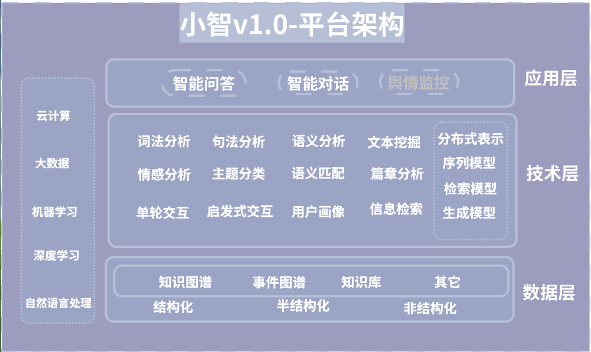

# 智能问答与对话系统研究与应用
## 小智平台初步技术架构　
  

---
## 对话系统分类  
- 问答型  
  + 结构性文档  
        - 数据库、知识库  
  + 非结构性文档  
        - 信息抽取/信息检索
- 对话型
   + 闲聊型
   + 任务型：领域分类/用户意图/槽位
## BAT对话研究论文学习总结  
- [ESIM_Alibaba](http://naotu.baidu.com/file/35d306210f00fa32e80819ab23faaacd?token=a21cc2541fea5bed) 
  
## 对话系统核心模块
> 自然语言理解模块 —— Natural Language Understanding (NLU)  
> 对话管理模块 —— Dialog Management (DM)  
> 自然语言生成模块 —— Natural Language Generation (NLG)  

---
Updated on August 5,2019

